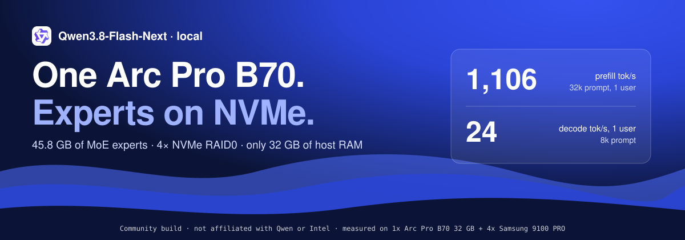

# qwen38-flash-next-b70-offload



Run **Qwen3.8-Flash-Next** (EXL3 3.05 bpw, 48 MoE layers x 512 experts, 45.8 GB of experts) on **one Intel Arc Pro
B70 32 GB** with an OpenAI-compatible API, using a little RAM and an NVMe drive for the experts that do not fit on the
card.

| RAM for the server | mode | decode, 1 user (8k) | decode, 4 users (8k) | prefill 8k / 32k | output vs stock exllamav3 |
|---|---|---|---|---|---|
| **16 GiB cap** + NVMe | **`nvme16`** | **29.2 tok/s** | 52.6 tok/s total | 1,139 / 1,184 tok/s | approximate: prefill panel top-1 0.985, KL 0.003; decode KL 0.055 |
| 32 GiB cap + NVMe | `nvme32` (srv23) | 25.6 tok/s | 32.4 tok/s total | 1,135 / 1,193 tok/s | approximate: prefill panel top-1 0.984, KL 0.003; decode KL 0.021 |

Both rows were measured in the same session on 2026-10-08 (run N130), on 1x Arc Pro B70 (PCIe 4.0 x16), AMD EPYC 7443P
(8 CPUs for the container), and 4x Samsung 9100 PRO in RAID0. Decode runs each answer to its natural end.

**Which one?** `nvme32` stays closest to stock output: its decode masks fewer experts. `nvme16` fits in half the RAM
and is faster, because it masks more experts during decode (16 GB decode KL 0.055 vs 0.021). Neither is bit-exact.
Full tables, NVMe and memory numbers, and the quality method: [docs/results.md](docs/results.md).

## Run it

**Docker.** Needs one Arc Pro B70 with the `xe` driver, `hf`, 80 GB for the checkpoint, and 45.8 GB for the expert
store on a local NVMe filesystem that supports `O_DIRECT` (xfs or ext4).

```bash
IMG=ghcr.io/sybil-solutions/qwen38-flash-next-b70-offload@sha256:__DIGEST__
M=turboderp-Qwen3.8-Flash-Next-exl3-3.05bpw_h5_ng5
hf download turboderp/Qwen3.8-Flash-Next-exl3 --revision 69e33439ae950f17bcbe95c98f117d80f759ab6d --local-dir /data/$M
docker run --rm -v /data/$M:/models/$M:ro -v /mnt/nvme/qwen-b70:/nvx "$IMG" pack-store    # once: 45.8 GB store
R=$(readlink -f /dev/dri/by-path/pci-0000:48:00.0-render)   # your B70's render node (lspci | grep B70)
docker run -d --name qwen-b70 --device $R --memory 16g --memory-swap 16g --shm-size 8g --ulimit memlock=-1 \
  -e QWEN_B70_MODE=nvme16 -p 127.0.0.1:30000:30000 -v /data/$M:/models/$M:ro -v /mnt/nvme/qwen-b70:/nvx:ro "$IMG" \
  python3 -m sglang.launch_server --model-path /models/$M --quantization exl3 --trust-remote-code --device xpu \
  --host 0.0.0.0 --port 30000 --served-model-name flashnext --disable-shared-experts-fusion --kv-cache-dtype fp8_e4m3 \
  --context-length 65536 --mem-fraction-static 0.85 --chunked-prefill-size 8192 --max-total-tokens 131072 \
  --max-running-requests 4 --dtype bfloat16 --max-mamba-cache-size 32 --cuda-graph-backend-decode full \
  --cuda-graph-bs-decode 1 2 4 --reasoning-parser qwen3 --tool-call-parser qwen3_coder
```

The server is ready in about 2.5 minutes at `http://127.0.0.1:30000/v1`, model `flashnext`. For 32 GiB use
`--memory 32g --memory-swap 32g -e QWEN_B70_MODE=nvme32`. Keep `--memory-swap` equal to `--memory`. Only the render
node is passed in; no `--ipc host`, seccomp or ptrace changes. Send one or two warm-up requests after start: the VRAM
expert cache starts empty and the first answer can be poor.

**Omarchy Local AI.** The launch is in the [local-ai-registry](https://github.com/sybil-solutions/local-ai-registry)
for `intel-arc-pro-b70-32gb`; the plugin builds the store and starts the server.

## How it works

```text
  +----------------------------------------------------------------------+
  | VRAM expert cache: 8,000 slots (14.9 GB), device-managed LRU         |
  | a pick that hits RAM is copied in by the kernel (write-through)      |
  +---------------^------------------------------------------------------+
                  | GPU reads RAM pages through xe SVM
  +---------------+------------------------------------------------------+
  | RAM tier: one 2 MiB page per expert in a sparse memfd, 2 GB / 7 GB   |
  | holds experts that are not in VRAM; evicted VRAM experts move here   |
  +---------------^------------------------------------------------------+
                  | O_DIRECT reads: 8 decode-fill queues, 32 prefill readers
  +---------------+------------------------------------------------------+
  | NVMe store: all 24,576 experts, one 4K-aligned 1.86 MB record each   |
  +----------------------------------------------------------------------+
```

- **Decode.** A pick in neither VRAM nor RAM is masked for that step (weight 0) and read from NVMe in the background,
  so decode never waits on the drive. That is why decode is approximate, and why more RAM means fewer masked picks.
- **Admission control (16 GB).** With a small RAM tier, queued reads used to hold the whole budget and every finished
  read was evicted before the GPU used it: the tier collapsed and ~470 of 480 picks were masked. Now only RAM copies of
  experts already in VRAM, or entries older than 4 steps, are evicted; new reads are admitted only into free budget
  (at most 256 in flight, most-missed first); 8 reader queues land them within a step or two.
- **Prefill.** For batches of 256+ tokens, each layer's experts that are not in VRAM stream NVMe -> RAM buffer -> copy
  engine -> VRAM while the previous layer computes. Prefill is GPU-bound (4.2 of 5.4 s per 8k forward is attention,
  GDN and dense work); NVMe runs at 16-22 % of the array.
- **Kernels.** SYCL sparse attention and block selection for the full-attention layers (ported from Strata, MIT),
  Triton hyper-connection kernels, and exl3xpu MoE kernels with the tier patches (`kernels/moe-a8`).

## More

- [docs/results.md](docs/results.md): every table (16 GB, 32 GB, srv20-srv26 history), NVMe and memory, quality
- `serve/`: image entrypoint, store packer, the campaign serve script and benchmark tools (`serve/n130/`)
- `plugin/`: SGLang exl3xpu plugin with tier mode, `exl3xpu/nvtier.py` (tiers, staged prefill, admission control)
- `kernels/`, `experimental/`, `research/`: kernels, work in progress (victim ring, GDN prefill, MTP), analyses

Known issues: the tier has a write-back race (an evicted expert can be flagged resident while its page is queued for
release); the victim ring in `experimental/n111-victim-ring` removes it and is not in the server yet. The B70 test box
has marginal PCIe links; no measurement here was taken during a fault window.

Credits: Qwen3.8-Flash-Next by the Qwen team; EXL3 and exllamav3 by turboderp (MIT); sparse attention adapted from
[Strata](https://github.com/Niko1221/Strata) (MIT); [SGLang](https://github.com/sgl-project/sglang). MIT license
(this repository); the weights carry their own license.
